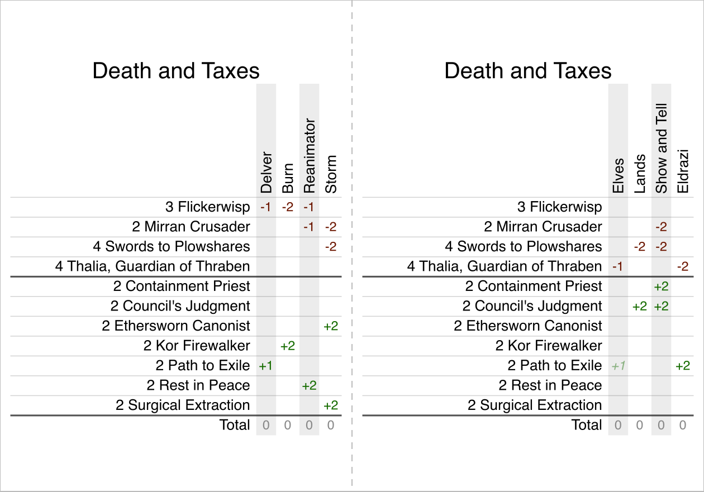

# Sideboard Printer

**Live app: <https://dgmora.github.io/sideboard-printer/web/>**

A free sideboard guide template for Magic: The Gathering and other card games. It turns a sideboard guide kept in Google Sheets into a card you can print and keep in your deck box.



## How it works

Keep one spreadsheet with a tab per deck, named after the deck. Start from the template linked on the page, share the spreadsheet as "Anyone with the link can view" and add its link: every tab becomes a guide. Edit the sheet and the card catches up within a minute. You can also paste a sheet or CSV directly.

Each half of the guide is a standard 63 × 88 mm card. Red numbers are cards to take out, green ones cards to bring in, and a `*` marks optional swaps. Guides with many matchups fold into two halves. Download the PDF and print it on A4 or Letter paper at 100% scale, or the SVG to print from your browser or edit the guide.

Already have a guide in another format? The page has a prompt you can give an AI assistant like Claude or ChatGPT to convert it, along with your decklist.

Everything runs in your browser. Your spreadsheet is never sent anywhere else, and the page only remembers your links and the guide you picked last, on your device. You can share a guide as a live link to your spreadsheet or as a snapshot stored in the link itself.

## Local development

The app is plain HTML, CSS and JavaScript in `web/`, with no build step. Serve the repository and open <http://localhost:8000/web/>:

```sh
python3 -m http.server
```

Run the tests with Node:

```sh
node web/guide.test.js
node web/pdf.test.js
```

Regenerate the example image above after changing how the card looks (needs `rsvg-convert`):

```sh
node scripts/example-image.js
```

## Contributing

Ideas, questions and feedback are best started in [Discussions](https://github.com/dgmora/sideboard-printer/discussions). Issues and pull requests are welcome too.

## Attribution

Inspired by and originally based on [sepro/MtG-Sideboard-Guides](https://github.com/sepro/MtG-Sideboard-Guides) by Sebastian Proost, which this project started as a fork of.
